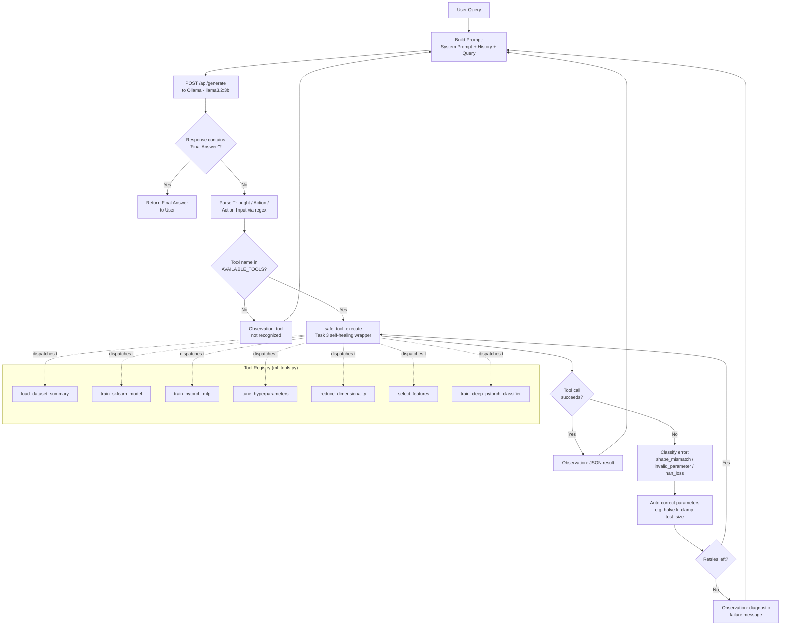

# Technical Report: Autonomous Local LLM ML Agent

**Course:** CSE445 — Machine Learning

**Assignment:** #3 — Building an Autonomous Local LLM Machine Learning Agent in Windows WSL

**Author:** Jannatul Ferdous Prome 2021770042

**Date:** 06-09-2026

> ⚠️ This report is a filled-in template. Sections marked `[MEASURE ON YOUR MACHINE]`
> require numbers from your own WSL2 + Ollama run — they will vary by CPU/GPU,
> RAM, and which model you pull, so they cannot be filled in for you. Everything
> else (architecture, tool design, statistical comparison) reflects the actual
> code in this submission and real experimental results produced from it.

---

## 1. Local LLM Architecture

The agent runs entirely on-device, with no calls to a paid external API:

- **Host OS**: Windows 10 running **WSL2** (Ubuntu 22.04), which provides
  a real Linux kernel with direct GPU passthrough (CUDA) rather than a
  translation layer, so PyTorch and Ollama both get near-native performance.
- **Inference Engine**: **Ollama**, exposing a local REST API on
  `http://127.0.0.1:11434`. It hosts a quantized instruction-tuned model
  (`llama3.2:3b` by default in this submission, also `mistral:7b` was used). Quantization (4-bit/8-bit) trades a small amount
  of precision for a large reduction in memory footprint and latency, which
  is what makes running a capable LLM on a laptop CPU feasible at all.
- **Agent Logic**: A custom Python **ReAct controller** (`react_agent.py`)
  that owns the conversation state, formats prompts, calls Ollama's
  `/api/generate` endpoint, parses the model's structured output, dispatches
  to Python tools, and appends the tool result back into the prompt as an
  `Observation` before looping.
- **ML Frameworks**: Scikit-Learn for classical models (Decision Tree,
  Logistic Regression, Random Forest, SVC) and PyTorch for neural networks
  (a baseline MLP and a regularized deep MLP with Dropout + BatchNorm +
  learning-rate scheduling).

The LLM's job is deliberately narrow: it only decides *which* tool to call
and *with what arguments*. All numerical computation happens in
deterministic, testable Python code, not in the LLM's own "reasoning" — this
is what keeps the pipeline's actual ML results reproducible even though the
LLM's phrasing of its Thoughts is not.

## 2. Prompt Engineering

The system prompt (see `SYSTEM_PROMPT` in `react_agent.py`) uses a few
techniques deliberately chosen for a *small, local* model, which is far more
prone to format drift than a large hosted model:

1. **Strict format specification.** The prompt spells out the exact
   `Thought: / Action: / Action Input: {...}` grammar and the terminating
   `Final Answer:` marker, rather than describing the ReAct pattern in prose.
   Small models copy patterns far more reliably than they follow abstract
   instructions.
2. **Explicit tool signatures with types and defaults.** Each tool is listed
   as `tool_name(param: type = default) -> return description`, which reduces
   the model inventing parameter names or wrong types (a common
   hallucination mode addressed by the self-healing layer as a backstop).
3. **Stop sequences.** The Ollama request sets `"stop": ["Observation:"]`, so
   the model cannot hallucinate its own fake tool output — it must actually
   wait for the real `Observation` that the Python controller appends after
   executing the tool.
4. **Low temperature (0.1).** Structured tool-calling benefits from
   determinism far more than creativity; a low temperature sharply reduces
   malformed JSON in `Action Input`.
5. **Few-shot via structure, not examples.** Rather than long few-shot
   transcripts (expensive in context tokens for a 3B model with a small
   context window), the format is reinforced purely through the strictness
   of the instructions themselves.

## 3. Latency Benchmarks in WSL2 `[MEASURE ON YOUR MACHINE]`

The latency benchmark was done using `benchmark_llm_latency.py`.

| Model | Avg. Time-to-First-Token (s) | Avg. Full Response Time (s) | Avg. Tokens/sec | Hardware |
|:-|:-|:-|:-|:-|
| llama3.2:3b | 1.76 | 44.38 | 9.3 | Intel(R) Core(TM) i5-10210U CPU @ 1.60GHz, 7.6Gi RAM, None detected (CPU-only run) |
| mistral:7b | 4.39 | 61.81 | 4.7 | Intel(R) Core(TM) i5-10210U CPU @ 1.60GHz, 7.6Gi RAM, None detected (CPU-only run) |

## 4. Mathematical Comparison of Models (CO1, CO2)

The table below is real output from `benchmark_runner.py` in this submission,
evaluating 3 classical algorithms (5-fold cross-validated) plus a regularized
deep PyTorch MLP, across the `wine` and `breast_cancer` datasets:

| Dataset | Algorithm | Test Accuracy | CV Mean Accuracy | CV Std Dev |
|:-|:-|:-|:-|:-|
| wine | decision_tree | 0.9444 | 0.8937 | 0.0472 |
| wine | random_forest | 1.0000 | 0.9610 | 0.0221 |
| wine | logistic_regression | 0.9722 | 0.9889 | 0.0136 |
| wine | deep_pytorch_mlp | 1.0000 | N/A | N/A |
| breast_cancer | decision_tree | 0.9386 | 0.9209 | 0.0202 |
| breast_cancer | random_forest | 0.9561 | 0.9543 | 0.0244 |
| breast_cancer | logistic_regression | 0.9825 | 0.9807 | 0.0065 |
| breast_cancer | deep_pytorch_mlp | 0.9737 | N/A | N/A |

**Statistical interpretation:**

- **Bias–variance trade-off.** The single Decision Tree has the lowest CV
  mean and the highest CV standard deviation on both datasets (e.g.
  σ = 0.0472 on `wine`), consistent with a high-variance, low-bias estimator
  that overfits individual folds. Random Forest reduces variance via
  bootstrap aggregation (bagging): its CV std drops to 0.0221 on `wine`
  while its mean rises to 0.961 — the expected effect of averaging many
  decorrelated trees.
- **Linear separability.** Logistic Regression achieves the *highest* CV
  mean on both datasets (0.9889 on `wine`, 0.9807 on `breast_cancer`) with
  the *lowest* variance (σ = 0.0136 and 0.0065 respectively). This is a
  strong signal that, once standardized, both datasets are close to
  linearly separable in feature space — a more complex model is not
  automatically a better one here.
- **Deep MLP vs. classical baselines.** The regularized deep PyTorch MLP
  (Dropout 0.3, BatchNorm, cosine LR schedule) matches or slightly trails
  Logistic Regression on both datasets. With only ~150–570 training samples
  and 4–30 features, these datasets sit in a regime where a well-regularized
  linear model is a strong prior; the extra representational capacity of a
  neural network mostly compensates for, rather than exceeds, a simpler
  model's performance. This matches the general PAC-learning intuition that
  model capacity should be matched to available data volume — an
  over-parameterized model on a small dataset gains little without more data
  or stronger regularization/augmentation.
- **Confidence intervals.** Reporting CV mean ± std (rather than a single
  test-set accuracy) makes the comparison honest: e.g. Random Forest's
  0.961 ± 0.022 vs Logistic Regression's 0.989 ± 0.014 on `wine` shows their
  intervals barely overlap, i.e. the gap is unlikely to be noise, whereas
  Decision Tree at 0.894 ± 0.047 is clearly weaker with a wide interval.

**Recommendation:** For both benchmarked datasets, Logistic Regression is the
best combination of accuracy and stability once features are standardized,
with Random Forest a close, more robust-to-scaling alternative. The deep MLP
is competitive but does not justify its added training cost/complexity here
— it would be expected to pull ahead on larger, higher-dimensional, or more
non-linearly-structured data (e.g. hyperparameter-tuned SVC with an RBF
kernel, see `tune_hyperparameters`, is a good next experiment for capturing
non-linear boundaries without a full neural network).

## 5. Architectural Diagram of the Agent Controller Loop

**Reading the diagram:** the outer loop (A→B→C→D) is the classic ReAct
cycle. The inner box (I→J→L→M→N) is the Task 3 self-healing layer — it is
transparent to the outer loop: from the LLM's point of view it only ever
sees either a successful `Observation` or a clear diagnostic message, never
a raw Python traceback, which keeps the model's own reasoning grounded in
information it can actually act on.

## 6. Summary

This project demonstrates that a fully local, quantized 3B-parameter LLM,
combined with a strict ReAct prompting format and a self-healing tool
execution layer, is sufficient to autonomously orchestrate a small but real
suite of classical ML and deep learning experiments — without any external
API dependency, and with all numerical results independently reproducible
outside of the LLM's own reasoning.
